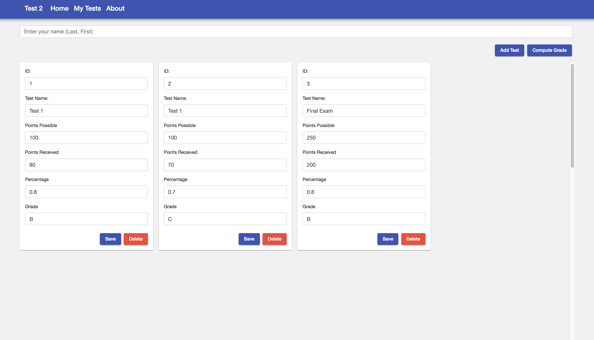
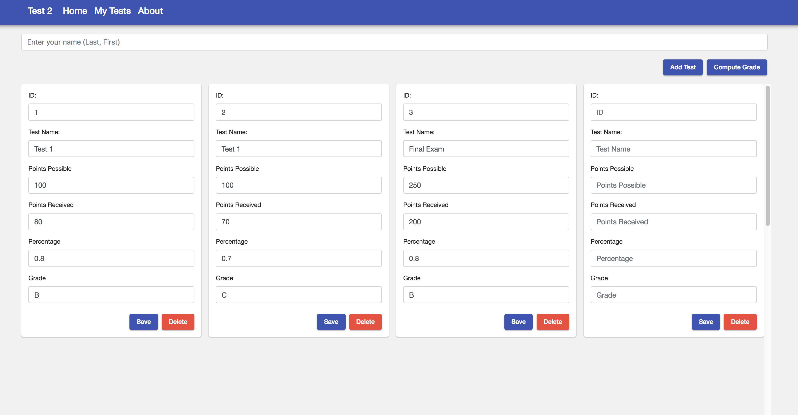
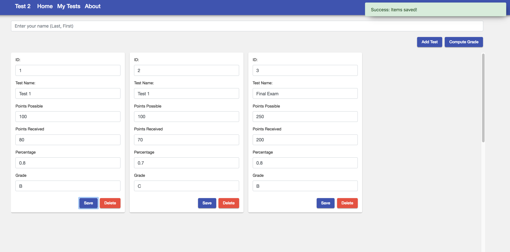
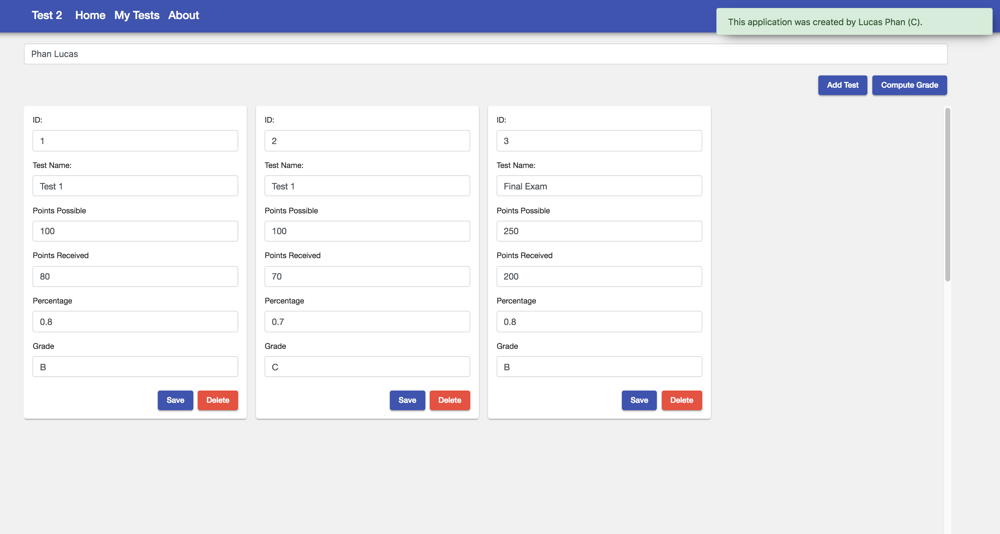
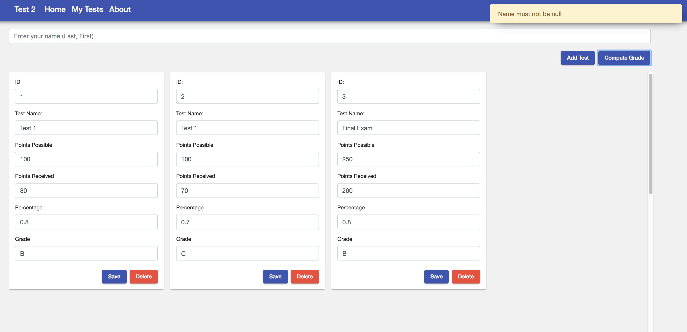
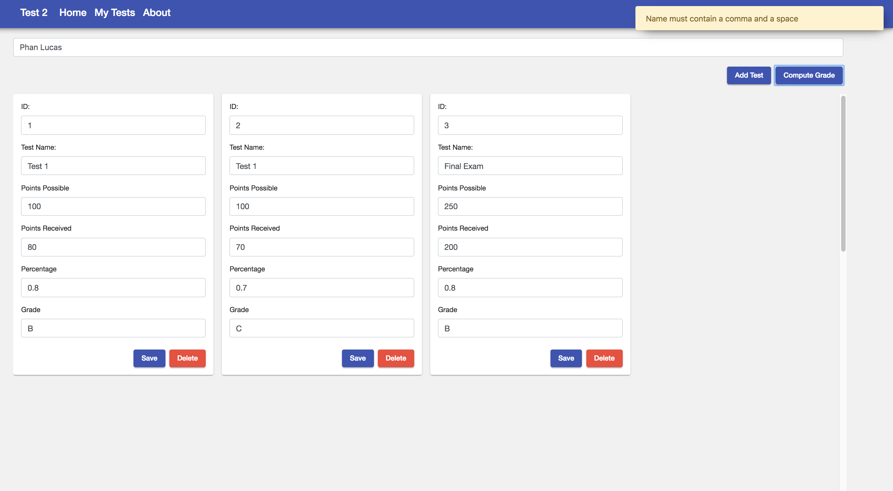
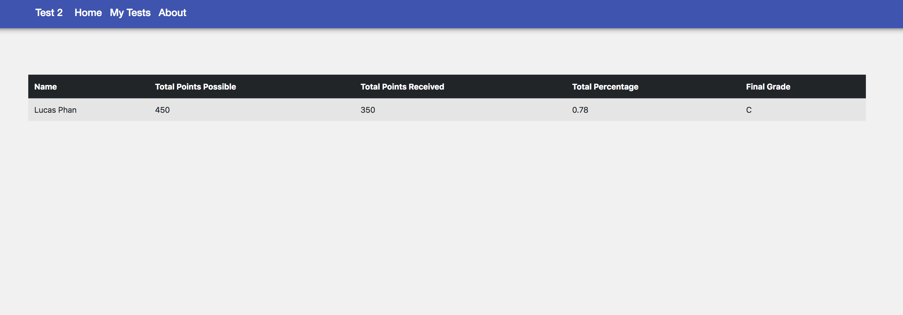

# Grading Application

## Development server

Run `ng serve` for a dev server. Navigate to `http://localhost:4200/`. The app will automatically reload if you change any of the source files.

## Instructions

### Computer Solution Problem (250 points)

1. Written component 25pts (~ 25 minutes)
2. GITFlow component 25pts (~ 10 minutes)
3. Code component 50pts (~ 115 minutes)

You can use any resources including  your books, notes, and memos for completing this part of the test; however, you cannot ask, share, or consult with anyone in the world. You can use the Internet for any searches. Any violation will automatically issue a zero on the Exam.

The GUI for the application is fully provided for you and you should not have to write any CSS or new HTML elements. Pull the application source code as specified according to the GITFlow section of this exam. Change html of the components items and write all necessary codes and complete the application.

Push all the files to your GITHub repo and change name of the top folder to “IS51Test2” (corresponding to your GITHub repo) upon completion of test.

Make sure the computer, VS Code, and the files / application is all working properly with no errors or warnings.

### Code Component - Test Grading Application

You are hired to create a Web application to computerize the exam grading process. The application should have a collection of tests that stores the following data: ID (a number), Points Possible (a number), Points Received (a number), Percentage (a number) and Grade (an string). Currently there are three exams data as shown below and the application should use an array of three custom objects (interface). If you don’t know how to use an array of custom interface, you can use an array of 'any' objects instead with 2.5 points penalty.

#### Exam Data
```
[{
    "id": 1,
    "testName": "Test 1",
    "pointsPossible": 100,
    "pointsReceived": 80,
    "percentage": 0.8,
    "grade": "B"
  },
  {
    "id": 2,
    "testName": "Test 1",
    "pointsPossible": 100,
    "pointsReceived": 70,
    "percentage": 0.7,
    "grade": "C"
  },
  {
    "id": 3,
    "testName": "Final Exam",
    "pointsPossible": 250,
    "pointsReceived": 200,
    "percentage": 0.8,
    "grade": "B"
  }
]
```

The data above is located in ```assets/tests.json``` for reference. 

Your application should allow the user to enter data for each item. When the "my-tests" page is initialized, check and load items from local storage. If there are items available, load the items into the view. If there are no items available in local storage, load the three test data from the test.json file and display them into the view. The user will enter any "points possible" and "points received" for each test. When “Compute Grade” button is clicked, Aggregate (sum up) the total points possible and total points received and calculate the total grade percentage. Also, calculate the letter grade based on the calculated percentage.

```HINT```
if the score is >= .90 grade is a 'A',
if the score is >= .80 grade is a 'B',
if the score is >= .70 grade is a 'C',
if the score is >= .60 grade is a 'D',
every other score, grade is an 'F'

you may use an IF/Else If/Else control structure or a Case statement

the "About" button displays a message, ```“This application is designed by <your name>. (C) 2018”``` in a “toast” ToastService (provided) or use an alert box less points.

The user enters his/her name in the name input box (Note: the format of name input ->; Lastname, Firstname; ex: Phan, Lucas). (comma with space between last name and first name) 

When "Delete" button is clicked, the corresponding Test item will be deleted.

When “Compute Grade” button is clicked, validate the name input box is not null or whether a comma and a space ie (', ') is not present. If there are errors, show a toast to the user of the error. Aggregate (sum up) the total points possible and total points received and calculate the total grade percentage and the letter grade based on the calculated percentage. Upon successful validation, navigate to the "home" page and display the results as show below. Perform string splicing to transform “LastName, FirstName” to “First Name Last Name” and the name property on the table should show: “<First Name> <Last Name>. (See screenshots)

### Validation (see screenshots below)

1. Name input field not specified (null or '').
2. Name not containing a “, ”.

### Add Additional Items (Test)

The "Add Test" button should add a new empty item into the view.

### Delete Item (Test)

When the delete button is pressed, delete the corresponding item from the list.

### Save Item (Test)

When the save button is pressed, save the items to local storage and display a toast 'Success: Items saved!'.


### My Tests Page (after loading items from tests.json or from local storage)


### My Tests Page (after Add Test button pressed)


### My Tests Page (after delete button pressed)


### My Tests Page (after save button pressed)



### About Toast (show on About button pressed)


### Validation Errors





### Home Page (displaying data computed from the My Tests page)


## Points Breakdown

1. Show a toast or an alert showing about text when the "About" link is pressed 2pts
2. convert name from <Last Name>, <First Name> to <First Name> <Last Name> and display text 5 pts
3. Aggregate and Calculate Total Points Possible, Total Points Received and the percentage 5 pts
4. perform input validation 5 pts
  ```
1. Name input field not specified. 2.5 pts
2. Name not containing a “, ”. 2.5 pts
  ```
5. Save the items to local storage when the "Save" button is clicked 5 pts
6. Add items when the "Add Test" button is clicked 5 pts
7. Delete item (test) when the "delete" button is clicked 5 pts
8. Read in the tests.json file and populate the list table with the initial tests (3) 5 pts
9. Read items from local storage and display the items into the view 5 pts
10. Display calculated results on the home page (see screenshot) 8 pts
